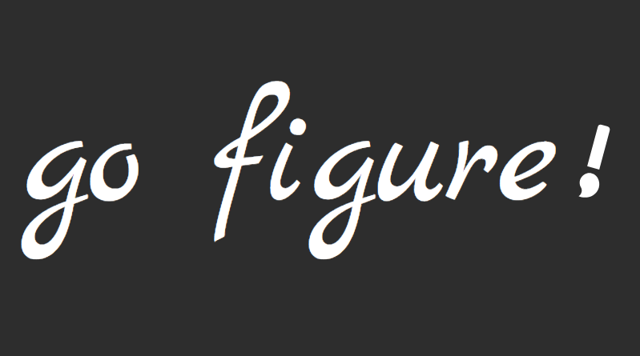
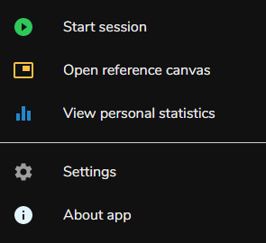
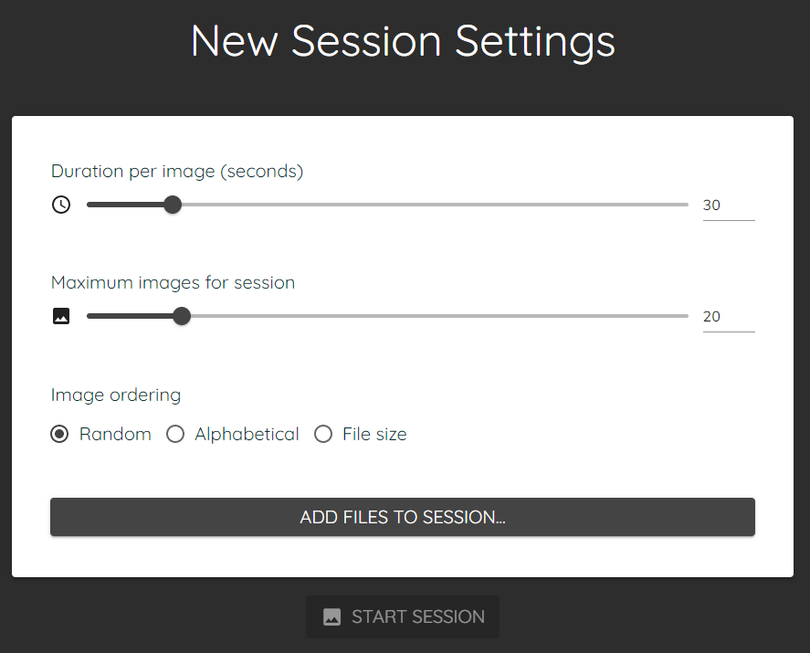
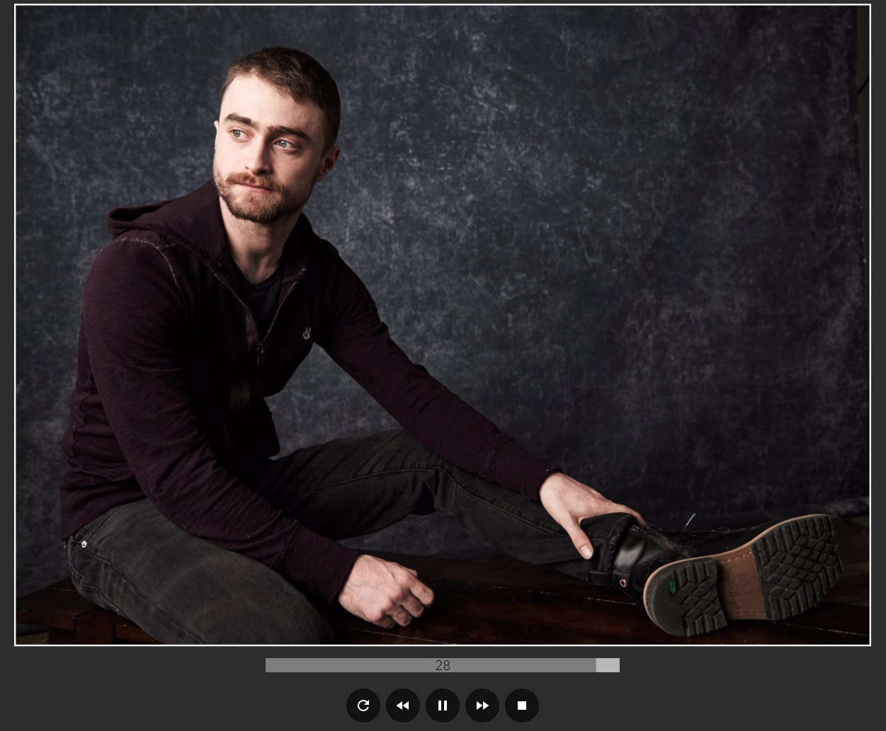
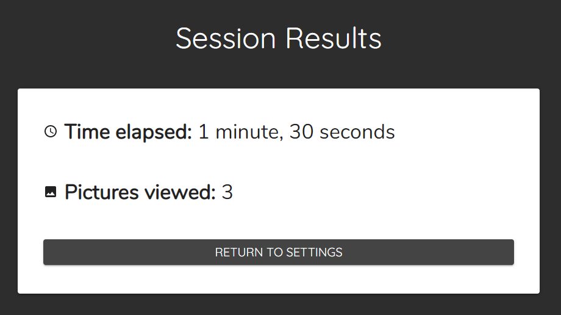
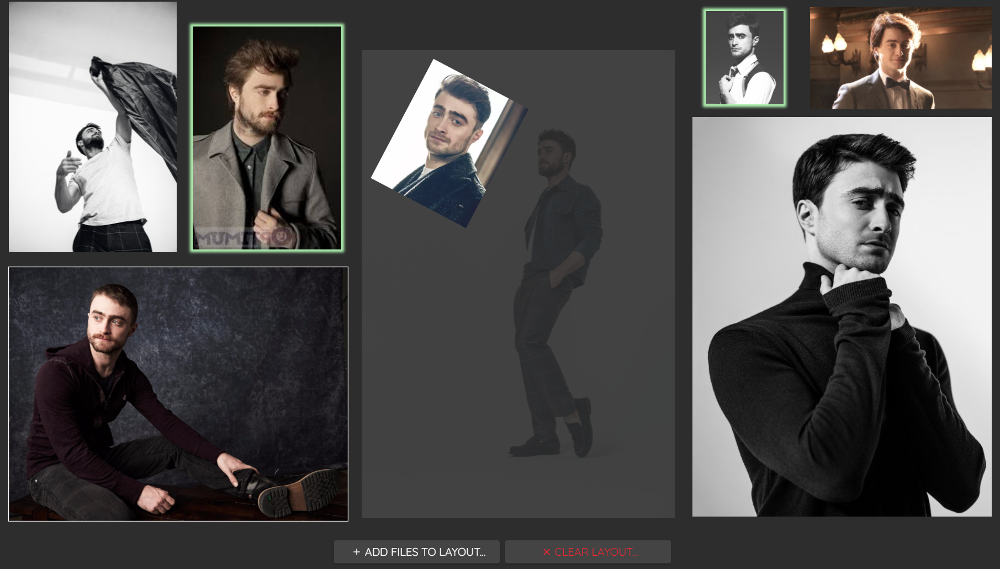
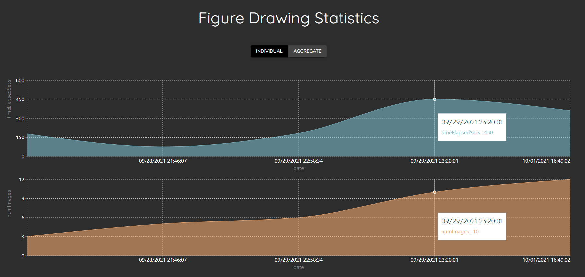

# Go Figure!

*Go Figure!* is an [Electron](https://www.electronjs.org/) desktop application that offers figure drawing practice for digital and traditional artists alike. It also provides a dynamic reference canvas for displaying an arbitrary number of images, all of which may be resized, mirrored, and so on to support the needs of the user.

## Sidebar

The sidebar expands on hover and allows the user to select a subpage of the application.

## Pages

### Figure Drawing

#### Settings

The settings page allows the user to select images for a drawing session along with particular parameters. 

#### Active Session

During an active session, each loaded image will display for the desired number of seconds. With the buttons at the bottom of the screen, one can, respectively:

* refresh the timer
* go back an image
* pause/start the session
* go forward an image
* stop the session

#### Results

Once a session has completed, the final results are shown.

### Reference Canvas

The reference canvas allows users to organize a collection of images for ease of viewing. These images can be loaded via the toolbar, or they can be dragged and dropped from other sources (a web page, file explorer, etc.).

### Statistics

If the user chooses to do so, they may save their figure drawing session statistics to file. The saved data will be loaded on start and available to view on the statistics page.

## About

This program is written in [React.js](https://reactjs.org/). It makes use of popular libraries such as [MUI](https://mui.com/), [React Redux](https://react-redux.js.org/), and [React Router](https://reactrouter.com/).